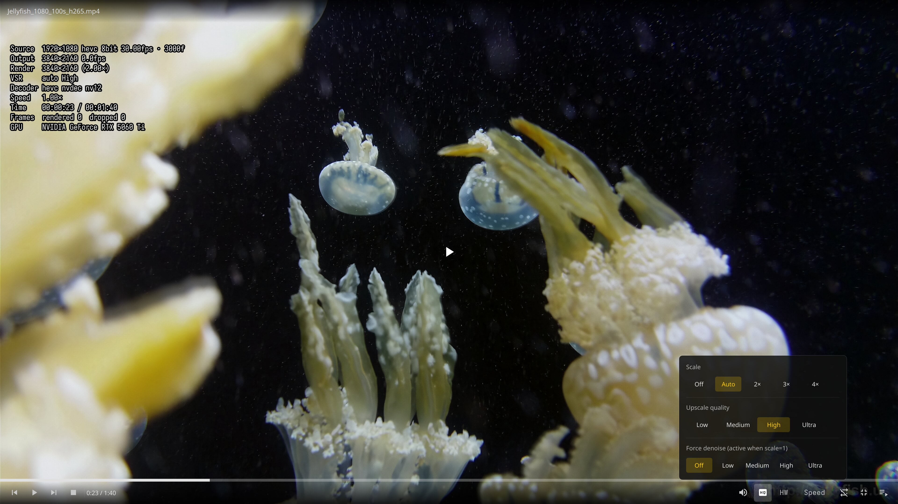

# VSR Player

Real-time AI super-resolution video player for Linux. Uses the NVIDIA Video Effects SDK to apply neural upscaling and denoising during video playback.

Built on **libmpv** — demux, decode, A/V sync, timing, and VO rendering are handled by mpv. VSR is injected as a custom mpv video filter (`vf_vsr`), which upscales via CUDA + the Video Effects SDK and feeds the result back into the mpv pipeline. The frontend is a Qt 6 + QML client (Vulkan, shared device with mpv).

## Background

NVIDIA RTX Video Super Resolution (RTX VSR) has been available on Windows for some time, integrated through the driver and supported by browsers and media players. On Linux, however, this driver-level interface is not exposed, and mainstream players (mpv, VLC, etc.) currently have no way to use RTX VSR.

The NVIDIA Video Effects SDK provides access to the same underlying AI models and does offer a Linux version, but it is not a straightforward dependency — it ships as an Early Access SDK with a substantial inference runtime (~1 GB), and there is no established integration path into existing players.

This project calls the Video Effects SDK C API directly from a player. This is not an ideal approach — processing of this kind belongs at the driver or compositor level — and exists only as a workaround until the driver-level VSR interface becomes available on Linux.

## Features

- **AI Super-Resolution** — real-time 2×/3×/4× upscaling via Tensor Cores (mpv video filter `vf_vsr`)
- **AI Denoising** — configurable denoise pass (Low to Ultra), works standalone at scale=1
- **AI Frame Interpolation (FRUC)** — RIFE-based motion interpolation to 40/48/60 fps or any target (mpv video filter `vf_rife`, TensorRT, runs before VSR at source resolution)
- **NVDEC Hardware Decode** — AV1, H.264, HEVC GPU decoding (software fallback; SW frames auto-uploaded via `vf_hwup`)
- **Vulkan Rendering** — CUDA-Vulkan shared device, mpv renders into the Qt scene graph
- **QML Overlay UI** — auto-hide controls (bottom hover zone driven), playlist with virtualized list, OSD info panel
- **Adaptive Scale** — auto-selects upscale factor based on viewport size
- **Playlist & Playback** — directory loading, loop modes, speed control, A/V sync handled by mpv
- **Remote Control** — JSON IPC over Unix socket; standalone `mpv-vsr` CLI

## Testing Status

This project is developed on limited hardware — a single GPU generation and a small set of test files. Not every GPU / driver / container combination can be covered, so expect rough edges: you may hit crashes, visual artifacts, or hangs that have never been seen here.

If something breaks, an effective path is to let an AI coding agent help you debug. This project itself is developed with AI agents — Claude Code running a DeepSeek model (a low-cost setup, nothing to be afraid of). The code, the mpv patch overlay, and the design records in `docs/` and commit history are all in place for an agent to understand the pipeline and locate issues quickly. Bug reports and pull requests are welcome either way.

## Screenshots



### VSR Comparison

**Original (720p)**


**VSR 4× Upscaled**


## Architecture

```
demux → decode → [vf_hwup] → [vf_rife] → [vf_vsr] → VO (libmpv) → Qt scene graph
                ↑            ↑               ↑
           SW→CUDA upload   RIFE (TRT)    VFX SDK + CUDA
```

- mpv manages: demux, decode, A/V sync, timing, seek, VO
- `vf_hwup`: SW frames (software decode) uploaded to CUDA so downstream filters always see hardware frames
- `vf_rife` (patch overlay `src/mpv/video/filter/vf_rife.c`): RIFE frame interpolation (TensorRT), runs at source resolution before upscaling
- `vf_vsr` (patch overlay `src/mpv/video/filter/vf_vsr.c`): receives `mp_image`, upscales via CUDA+VFX SDK, outputs upscaled `mp_image`
- Frontend: Qt 6 + QML (`src/client/`) — MpvController (libmpv wrapper), PlayerViewModel (single source of truth), Vulkan shared device
- mpv patch scheme: `third_party/mpv` (pristine 0.41) + `src/mpv` overlay, merged by `scripts/build_mpv.sh`

## Prerequisites

| Component | Requirement | Applies to |
|-----------|-------------|------------|
| GPU | NVIDIA RTX 20-series or newer (FRUC needs Ampere+ with FP16 Tensor Cores) | all |
| Driver | 570+ (with CUDA; Wayland works out of the box — DRM modeset is enabled by default on modern drivers) | all |
| Qt | 6.11+ (Quick, QuickControls, Vulkan) | source build / standard tarball (**the full tarball bundles Qt**) |
| C++ Compiler | GCC 13+ (C++20) | source build |
| Build | meson, ninja, CUDA Toolkit (`/opt/cuda`), TensorRT (system `trtexec`, for engine builds) | source build |

Third-party SDKs (NvVFX headers/runtime, MDI icon font, mpv source) are **not** bundled in the repo — see [docs/third-party-setup.md](docs/third-party-setup.md) to prepare `third_party/` (needed for source builds).

## Installation

### Option A (recommended): build from source

Build on your own machine: the resulting binaries **match your system libraries by construction**, so a system upgrade is fixed by re-running the same command — no "stale soname → won't start" class of breakage (which this project hit for real when libcdio/libbluray were upgraded).

```bash
git clone https://github.com/zhangmq/vsr-player && cd vsr-player
# 1) prepare third_party/ per docs/third-party-setup.md (NvVFX runtime, MDI font, mpv source, RIFE ONNX)
./scripts/build-from-source.sh
```

One command does it all: dependency self-check → build libmpv + client → install to `~/.local` (no sudo) → record a dependency snapshot. The first run fetches the VFX runtime from **NVIDIA's official index** (~0.6 GB wheel, ~1.1 GB once extracted); add `--no-vfx` to skip if you already have it, plus `--no-install` / `--jobs N`.

**After a system upgrade** (Qt/FFmpeg/media-library soname changes break stale binaries):

```bash
./scripts/check-deps.sh              # shows drift (build-time snapshot vs current system libs)
./scripts/build-from-source.sh       # rebuild with one command
```

### Option B: prebuilt tarball

For when you'd rather not compile, or your distro lacks FFmpeg 9.x development packages.

| | standard (default) | full (bundles Qt) |
|---|---|---|
| Bundles | libmpv + ffmpeg ×7 + CUDA runtime + TensorRT 11 + RIFE engine + **optical-media stack** (libcdio/libdvd/libbluray) + fonts/translations/licenses | the same **+ Qt6** (libs / platform plugins / QML modules) |
| Still needs from the system | **Qt ≥ 6.11**, Vulkan loader, Wayland/X11 client libs, NVIDIA driver | Vulkan loader, Wayland/X11 client libs, NVIDIA driver |
| For | rolling-release distros (Arch/CachyOS/Fedora…) | distros with Qt < 6.11 (Debian stable, Ubuntu LTS…) |
| Size | ~320 MB | ~340 MB |

```bash
tar -xJf vsr-player-<ver>-linux-x86_64[-full].tar.xz
./install.sh                         # installs to ~/.local, no sudo
```

Check with `pkg-config --modversion Qt6Quick`: ≥ 6.11 → standard, otherwise → full.

- The **VFX runtime** (~0.6 GB wheel, ~1.1 GB extracted) is **not** bundled (NVIDIA's SLA forbids redistribution): `install.sh` downloads and extracts it from **NVIDIA's official index `pypi.nvidia.com`** (plain curl, no pip, no system changes), or you can place it in `~/.local/lib/vsr-player/` manually.
- Packaging uses "explicit core set + auto-discovered media stack + **closure check at package time**": any dependency that is neither bundled nor on the system allowlist fails the build, so a broken tarball can't ship silently.
- Both variants also rely on ordinary distro components: the Vulkan loader, Wayland/X11 client libraries, and mpv/FFmpeg optional deps (libass, libplacebo, libmujs, liblcms2, libwebp, libopenjp2, the 1394 capture libs, …) — all validated by the closure check.

## Manual Build (development/debugging)

1. **Prepare `third_party/`** — NvVFX SDK headers/runtime, MDI icon font, mpv source, CUDA 12 archive, RIFE ONNX asset: follow [docs/third-party-setup.md](docs/third-party-setup.md).
2. **Build and run:**

```bash
./scripts/build_mpv.sh          # merge src/mpv overlay → third_party/mpv, build libmpv + filters
ninja -C build                  # build the Qt client
./build/src/client/vsr-player <video-or-directory>
```

**Notes / gotchas:**

- **mpv patch scheme**: `third_party/mpv` is the pristine base; `src/mpv/` is the overlay (mirrors the mpv tree, only modified files). After editing anything under `src/mpv/`, you **must** re-run `./scripts/build_mpv.sh` — `build/mpv` is a *merged copy*, and running `ninja` on it alone silently keeps the stale copy (a known footgun; a full rebuild surfaces it).
- **`build_mpv.sh` output is grep-filtered** — a failed compile can be hidden. Confirm the build finished by checking for the final "Done" line.
- **Don't `cd build` and then use `./build/...`** — relative paths break. Stay at the repo root or use absolute paths.
- **After system library upgrades** (FFmpeg, Qt, TensorRT, libcdio, … — pacman/apt) stale binaries link the old sonames and fail to start: run `./scripts/build-from-source.sh` to rebuild with one command (or manually `./scripts/build_mpv.sh` + `ninja -C build`). `./scripts/check-deps.sh` compares against the build-time snapshot and tells you whether a rebuild is needed.
- **RIFE engine**: built with the system `trtexec` via `bash tests/fruc/build_rife_full_engine.sh` (dynamic-shape FP16, `--hardware-compat on` for cross-architecture). Requires the RIFE ONNX asset in `third_party/rife/`.
- **Development install**: `./scripts/install.sh` works from a repo checkout too (dev mode — picks up the build tree automatically, no tarball needed).
- **Distributable build**: `./scripts/build_release.sh [--variant=standard|full]` — release build + `$ORIGIN`-relative RPATH + dependency collection + closure check + tarball (`--engine=<path>` reuses an existing engine and skips trtexec). `build_mpv.sh`/client builds accept `MPV_BUILD_DIR`, `BUILDTYPE`, `DIST_RPATH` env overrides (used by the release scripts).

## Version Compatibility

| Component | Binding | If mismatched |
|-----------|---------|---------------|
| **VFX SDK ↔ driver** | The latest NVIDIA-index wheel may require a newer driver; an old driver + new VFX → VSR fails to load | Upgrade the driver, or pin an older VFX version (below) |
| **RIFE engine ↔ TensorRT** | Engine files embed the exact TRT version that built them — deserialization fails on version mismatch (verified in both directions) | Rebuild the engine with your system TRT (`bash tests/fruc/build_rife_full_engine.sh`), or install a matching TRT. Tarball users: engine + bundled TRT ship together and are self-consistent. The VFX SDK's own TRT 10 libs coexist with RIFE's TRT 11 in one process (RTLD_LOCAL isolation) — nothing to do |
| **Qt** | Hard requirement ≥ 6.11 for the source build and the standard tarball (QML/QuickControls features used) | Upgrade the system Qt, or switch to the **full tarball** (bundles Qt6 — no system Qt needed) |
| **GPU** | VSR needs RTX 20+; FRUC needs Ampere+ (FP16 Tensor Cores) | Older GPUs: VSR works, interpolation degrades to passthrough |
| **Driver** | 570+ for VFX; Wayland needs no kernel parameters on modern drivers (modeset on by default) | Upgrade, or pin an older VFX wheel |

**Pinning a VFX SDK version** — `install.sh` always fetches the **latest** `nvidia-vfx` wheel from **NVIDIA's official index** (`pypi.nvidia.com`; pypi.org only carries a placeholder sdist). If the default doesn't work with your setup (e.g. driver too old), you are not forced to use it:

```bash
# 1. list available versions (wheels live on NVIDIA's index, not pypi.org)
pip index versions nvidia-vfx --extra-index-url https://pypi.nvidia.com

# 2. download a specific version's wheel (pip download only fetches; no install)
pip download nvidia-vfx==<version> --no-deps --extra-index-url https://pypi.nvidia.com -d /tmp/vfx

# 3. extract its libs into the app's lib dir
unzip -o /tmp/vfx/nvidia_vfx-<version>*.whl "nvvfx/libs/*" -d /tmp/vfx
cp /tmp/vfx/nvvfx/libs/*.so* ~/.local/lib/vsr-player/
```

Note: `vsr_proc.c` dlopens the VFX libs by their **unversioned** names (`libnppc.so`, `libcudnn.so`, `libnvidia-ngx-vsr.so`, …), but the wheel only ships versioned files (`.so.12`, `.so.9`, …). The automatic download path in `install.sh` creates the missing unversioned symlinks; if you placed the files manually, create them yourself or the VFX load chain breaks (VSR silently passes through):

```bash
cd ~/.local/lib/vsr-player/
for t in libnppc libnppial libnppicc libnppidei libnppig libnppif \
         libnppim libnppist libnppitc libcudnn libnvidia-ngx-vsr; do
  for s in "$t".so.*; do [ -e "$s" ] && ln -sf "$s" "$t.so" && break; done
done
```

`install.sh` never forces a version onto your system — everything lives in `~/.local/lib/vsr-player/`, and replacing the VFX files there is the supported way to switch.

## Troubleshooting

### Won't start: `error while loading shared libraries: libXXX.so.NN`

**Cause**: a system library was upgraded and its **soname changed** (measured examples: libcdio `.so.19 → .so.21`, libbluray `.so.3 → .so.4`), while the already-built binary still links the old name. This is not an application bug — it is a binary/system-library version mismatch that affects essentially every native Linux program. The whole point of the source-build path is to make it disappear.

**Diagnose**:

```bash
./scripts/check-deps.sh
```

- `❌ … missing: libXXX.so.NN` → that soname no longer exists on the system (fatal — rebuild or switch packages)
- `⚠ libXXX was replaced since the build` → the library file was upgraded in place (a rebuild is advisable)
- Neither → something else; when filing an issue include `ldd ~/.local/bin/vsr-player | grep "not found"` plus the `check-deps.sh` output

**What to do, by install method**:

| Install method | Action |
|---|---|
| **Source build** | Re-run `./scripts/build-from-source.sh` — one command rebuilds binaries that match your current system libraries. **This is the main reason the source path is recommended**: you can fix it yourself immediately instead of waiting for a new release |
| **standard / full tarball** | What the package bundles (ffmpeg/CUDA/TRT/media stack, plus Qt in the full variant) is unaffected; what breaks are the libraries it still takes **from the system** (Qt, Vulkan, Wayland/X11, mpv optional deps). In order: ① download a **newer tarball** (its bundled set has followed along) ② switch to a source build ③ temporary workaround below |

**Temporary workaround (not for the long term)**: create compatibility symlinks for the missing soname — **only safe when the old and new libraries are ABI-compatible**:

```bash
mkdir -p ~/.local/lib/compat
ln -sf /usr/lib/libcdio.so.21 ~/.local/lib/compat/libcdio.so.19   # use the library from the actual error
LD_LIBRARY_PATH=~/.local/lib/compat vsr-player <video-or-directory>
```

⚠️ A soname major bump usually means the ABI changed. The feature paths this project doesn't use (CDDA, Blu-ray menus) are low risk, but **don't treat this as a permanent fix** — the real fix is a rebuild (source path) or a newer package.

**Don't**: downgrade a single library on a rolling-release distro (partial upgrade) — it creates more mismatches than it solves.

### Upscaling has no effect (playback looks fine, but nothing is upscaled)

When the VFX runtime is missing or fails to load, `vf_vsr` **passes through silently** (video still plays, no error) — so "it looks fine" does not mean VSR is working. Check:

- The startup log for `VSR: nvVFX libraries loaded`; if it's absent, VFX never loaded
- `ls ~/.local/lib/vsr-player/libNVCVImage.so` and whether the **unversioned** symlinks (`libnppc.so`, `libcudnn.so`, …) are present — `vsr_proc.c` dlopens unversioned names, and a missing symlink breaks the whole VFX chain
- Re-fetch: run `./scripts/install.sh` (downloads from NVIDIA's official index), or place the files manually per [docs/third-party-setup.md](docs/third-party-setup.md)
- An outdated driver also makes VFX fail to load: the **VFX version ↔ driver** pair must match (see "Pinning a VFX SDK version" above)

### Frame interpolation inactive / engine deserialization error

A RIFE engine embeds the **exact TensorRT version that built it**; after a TRT upgrade the old engine is refused at deserialization (interpolation silently degrades to passthrough):

```bash
bash tests/fruc/build_rife_full_engine.sh    # rebuild the engine with your current system TRT
```

Tarball users normally don't need this: the engine inside the package is self-consistent with the bundled TRT — only replacing the system TRT yourself requires a rebuild.

## Usage

- Play a file or directory (a directory loads all playable files into the playlist)
- Quality control: bottom bar `Quality` popup — scale off/auto/2×/3×/4×, VSR quality, denoise
- Playlist panel: `P`; auto-hide UI driven by the bottom hover zone (mouse leaves → UI hides)
- OSD: `Tab` toggles the mpv-rendered info overlay (source, output, render, decoder, GPU…)

### CLI Options

| Option | Values | Default | Description |
|--------|--------|---------|-------------|
| `--scale` | `off`, `auto`, `2`, `3`, `4` | `auto` | Super-resolution scale |
| `--quality` | `low`, `medium`, `high`, `ultra` | `high` | Upscale quality |
| `--denoise` | `off`, `low`, `medium`, `high`, `ultra` | `off` | Denoise quality (applied at scale=1) |
| `--fruc` | `off`, `40`, `48`, `60`, `2`, `3`, `4` | persisted | Frame interpolation: target fps (40/48/60) or ×multiplier (2/3/4, benchmark mode) |
| `--no-hwaccel` | — | — | Disable NVDEC, use software decode |
| `--lang` | e.g. `en`, `zh_CN` | system locale | UI language |
| `--benchmark` | — | — | Headless throughput measurement (no UI, `all=no` logging) |
| `--vsync` | — | off | FIFO present (non-blocking by default; Wayland has no tearing) |
| `--no-rpc` | — | — | Disable JSON IPC server |

### Keyboard Shortcuts

| Key | Action |
|-----|--------|
| `Space` | Play / Pause |
| `←` / `→` | Seek ±5s (`Shift` + arrow = ±10s) |
| `↑` / `↓` | Volume ±5% |
| `S` | Screenshot |
| `Tab` | Toggle OSD |
| `N` / `B` | Next / Previous file |
| `[` / `]` / `\` | Speed 0.5× / 2× / 1× |
| `P` | Toggle Playlist |
| `F` | Toggle Fullscreen |
| `Esc` | Exit fullscreen / close playlist |

## Remote Control

JSON IPC over Unix socket (`/tmp/vsr-player.sock`):

```bash
printf '{"command":["play"]}\n' | socat - UNIX-CONNECT:/tmp/vsr-player.sock
```

Commands: `play`, `pause`, `stop`, `seek`, `loadfile`, `set-vsr`, `get-vsr`, `quit`, plus raw `command` passthrough. A standalone CLI (`scripts/install_mpv_local.sh`) installs `mpv-vsr` — the patched mpv binary with `--vf=vsr` support.

## Standalone mpv-vsr CLI

The patched mpv binary (with `vf_vsr` + `vf_rife` + `vf_hwup` filters) is also built and shipped standalone,
usable as a plain mpv replacement:

```bash
mpv-vsr --hwdec=auto --vf=hwup,rife:fps=60,vsr:scale=2 video.mkv
```

Filter chain (left to right): `hwup` (SW→CUDA upload, enables soft-decode path) → `rife` (interpolation, source resolution) → `vsr` (upscaling). Use `--hwdec=nvdec` for hardware decode (then `hwup` is a no-op passthrough).

Filter options:

| Option | Values | Description |
|--------|--------|-------------|
| `scale` (vsr) | `off`, `auto`, `2`, `3`, `4`, ratio (e.g. `4/3`) | Upscale factor; `auto` picks by viewport |
| `quality` (vsr) | `low`, `medium`, `high`, `ultra` | VSR inference quality |
| `denoise` (vsr) | `off`, `low`, `medium`, `high`, `ultra` | Denoise pass (works at scale=1) |
| `fps` (rife) | `off`, `auto`, integer 1..120 | Interpolation target fps; `auto` = 2×source |
| `scale` (rife) | `off`, `2`, `3`, `4` | Benchmark multiplier (no adaptive passthrough) |
| `adaptive` (rife) | `yes`, `no` | Cost-based passthrough when interpolation is too slow |

Example: `mpv-vsr --hwdec=nvdec --vf=rife:fps=60,vsr:scale=auto,quality=ultra video.mkv`

`mpv-vsr-wrapper.py` (browser integration, ff2mpv-style): exports Chrome cookies,
extracts playlists via yt-dlp (YouTube/Bilibili/Niconico), and launches mpv-vsr.
Personal-use tool, not shipped in the release tarball — interested readers are
welcome to study it on their own.

## License

VSR Player is licensed under the GNU General Public License version 2 or later (GPLv2+).

See [LICENSE](LICENSE) for the full license text.

The project builds on [mpv](https://github.com/mpv-player/mpv) (GPLv2+): it compiles a
patched mpv (custom `vf_vsr` filter) and links the frontend against libmpv — the
distributed binaries are therefore derivative works of mpv, and the whole project is
distributed under GPLv2+. The Qt/QML frontend code itself is developed independently.

The NVIDIA Video Effects SDK runtime libraries loaded at runtime are NVIDIA proprietary
software and are not subject to the GPL license of this project.

---

[中文版](README_zh.md)
