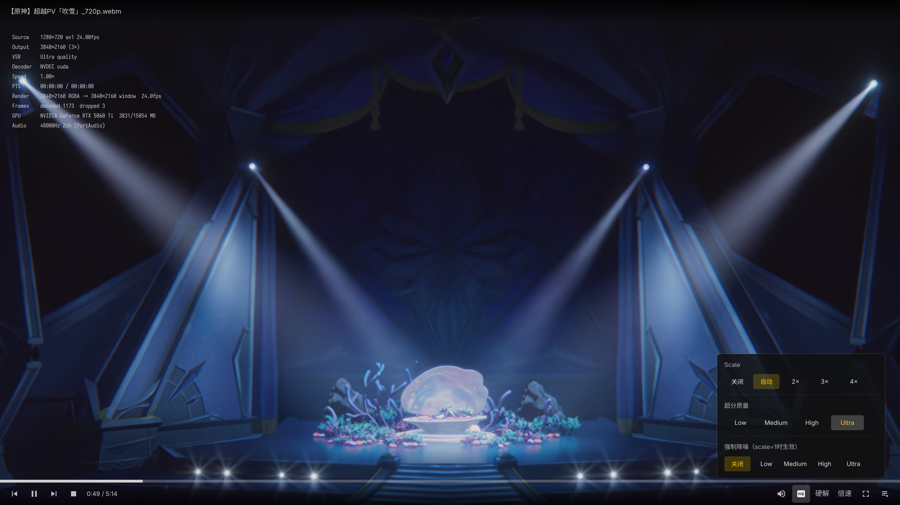

# VSR Player

Linux 桌面实时 AI 超分辨率视频播放器。使用 NVIDIA Video Effects SDK 在视频播放过程中进行神经超分和降噪——全 GPU 管线，零 PCIe 拷贝。

## 背景

NVIDIA RTX Video Super Resolution（RTX VSR）在 Windows 上已经可用了一段时间，通过驱动集成，浏览器和主流播放器都能直接调用。但在 Linux 上，这个驱动级接口并未开放，mpv、VLC 等播放器目前都无法使用 RTX VSR。

NVIDIA Video Effects SDK 提供了相同的底层 AI 模型，也有 Linux 版本，但它并不是一个拿来就能用的依赖——目前还是 Early Access 状态，附带约 1 GB 的推理运行时，也没有现成的播放器集成路径。

这个项目直接调用了 Video Effects SDK 的 C API，将其接入一个独立的播放器中。这不是一条特别合理的路线——这类处理逻辑理应放在驱动或合成器层面——只是在驱动级 VSR 尚未支持 Linux 的情况下的一个变通方案。

## 特性

- **AI 超分辨率** — 通过 Tensor Cores 实时超分 2×/3×/4×
- **AI 降噪** — 可配置降噪强度（低至超高）
- **NVDEC 硬解码** — AV1、H.264、HEVC GPU 解码，零拷贝帧
- **Vulkan 渲染** — CUDA-Vulkan 互操作，帧数据全程不离开 GPU 显存
- **QML 叠加 UI** — 半透明控件，自动隐藏、播放列表、OSD 信息面板
- **音视频同步** — 音频主时钟，基于真实 PTS 的同步策略
- **自适应缩放** — 根据视频分辨率和窗口大小自动选择超分倍率
- **零系统依赖** — 所有 VFX 库（约 1.1 GB）随应用打包，仅需 `libcuda.so.1`

## 截图



### VSR 效果对比

**原始画面（720p）**


**VSR 4× 超分**


## 环境要求

| 组件 | 最低版本 |
|------|---------|
| NVIDIA 驱动 | 570+ |
| Qt 6 | 6.8+ (Quick, QuickControls, Vulkan) |
| FFmpeg | 6.0+ (libavformat, libavcodec, libavutil, libswscale) |
| PortAudio | 19+ |
| Vulkan SDK | 1.3+ (loader + glslc) |
| glslc | (着色器编译器，Vulkan SDK 包含) |
| C++ 编译器 | GCC 13+ 或 Clang 18+ (C++20) |

## 第三方 SDK

本项目依赖两个 NVIDIA SDK。详见 [third_party/README_zh.md](third_party/README_zh.md)。

| SDK | 组件 | 协议 | 获取方式 |
|-----|------|------|----------|
| CUDA Toolkit | 头文件 + NVRTC | NVIDIA 专有 | `sudo pacman -S cuda`（release 包已内置） |
| NvVFX | 头文件 | MIT | 随源码分发 |
| NvVFX | 运行时（约 1.1 GB） | NVIDIA 专有 | `pip install nvidia-vfx` |

> NvVFX 运行时**不包含**在 release 包中——NVIDIA 许可不允许再分发。`install.sh` 会自动处理此步骤。

## 快速开始

### 从 Release 安装（推荐）

从 [GitHub Releases](https://github.com/zhangmq/vsr-player/releases) 下载最新的 `vsr-player-<ver>-linux-x86_64.tar.gz`。

```bash
tar xzf vsr-player-*.tar.gz
cd vsr-player-*
./install.sh
```

添加到 PATH 后运行：

```bash
export PATH="$PATH:$HOME/vsr-player/bin"
vsr-player /path/to/video.mp4
```

安装脚本会自动检测系统依赖、安装 NVIDIA VFX 运行时（`pip install nvidia-vfx`）并部署到 `~/vsr-player/`。无需 root。

### 从源码构建

```bash
# 1. 克隆
git clone https://github.com/zhangmq/vsr-player.git
cd vsr-player

# 2. 准备第三方依赖（详见 docs/BUILD.md）
#    - CUDA 头文件/库放在 third_party/cuda/ 或设置 CUDA_HOME
#    - NvVFX 头文件放在 third_party/nvvfx/include/（MIT，来自 GitHub）
#    - NvVFX .so 放在 third_party/nvvfx/lib/（pip install nvidia-vfx）

# 3. 构建（着色器编译已包含）
make -j$(nproc)

# 4. 运行
./build/vsr-player /path/to/video.mp4
```

## 命令行参数

| 参数 | 可选值 | 默认值 | 说明 |
|------|--------|--------|------|
| `--scale` | `off`, `auto`, `2x`, `3x`, `4x` | `auto` | 超分辨率倍率 |
| `--quality` | `low`, `medium`, `high`, `ultra` | `high` | 超分质量 |
| `--denoise` | `off`, `low`, `medium`, `high`, `ultra` | `off` | 降噪质量（scale=1 时生效） |
| `--depth` | 整数 | `3` | 文件夹扫描深度 |
| `--no-hwaccel` | — | — | 禁用 NVDEC，使用软解 |

## 键盘快捷键

| 按键 | 功能 |
|------|------|
| `Space` | 播放 / 暂停 |
| `F` | 切换全屏 |
| `P` | 切换播放列表 |
| `Tab` | 切换 OSD 信息面板 |
| `Esc` | 关闭播放列表 / 停止 |
| `B` | 上一个文件 |
| `N` | 下一个文件 |
| `S` | 截图 |

## 架构

```
Qt Client (主线程)                        libvsrplayer (工作线程)
┌──────────────────────────┐          ┌─────────────────────────────────┐
│ QML Overlay              │          │ PlayerCore — 命令队列 +         │
│ ├─ TopBar                │  命令/   │              播放状态机          │
│ ├─ BottomBar             │  事件    │ ├─ Demuxer (libavformat)        │
│ ├─ VolumePopup           │◄────────►│ ├─ Decoder (NVDEC hwaccel)      │
│ ├─ QualityPopup          │  桥接    │ ├─ VSRProcessor (NvVFX)         │
│ ├─ SpeedPopup            │          │ ├─ Renderer (Vulkan)            │
│ ├─ PlaylistPanel         │          │ ├─ AudioOutput (PortAudio)      │
│ ├─ ProgressSlider        │          │ ├─ ClockManager (A/V 同步)      │
│ ├─ CenterPlayBtn         │          │ └─ NV12ToRGB (CUDA kernel)      │
│ └─ OsdOverlay            │          │                                 │
└──────────────────────────┘          └─────────────────────────────────┘

数据流（全 GPU，零 PCIe 拷贝）：
  Container → Demux → NVDEC → NV12(GPU) → NV12→RGB(GPU) → VSR → RGBA(GPU)
                                                              → CUDA-Vulkan 互操作
                                                              → Vulkan 渲染通道
                                                              → 屏幕
```

## 目录结构

```
vsr-player/
├── src/
│   ├── client/                 # Qt 客户端（链接 libvsrplayer）
│   │   ├── main.cpp            # 入口、QQuickView + Vulkan 初始化
│   │   ├── PlayerViewModel.*   # QML ↔ Core 桥接
│   │   ├── PlaylistEngine.*    # 文件夹扫描 + 文件列表模型
│   │   ├── KeyFilter.*         # 键盘事件过滤器
│   │   ├── QtVulkanContext.*   # RAII Vulkan 实例封装
│   │   ├── shaders/            # GLSL 顶点/片段着色器
│   │   └── ui/                 # QML 组件
│   │       ├── overlay.qml     # 主叠加层（接线层）
│   │       ├── TopBar.qml
│   │       ├── BottomBar.qml
│   │       ├── VolumePopup.qml
│   │       ├── QualityPopup.qml
│   │       ├── SpeedPopup.qml
│   │       ├── PlaylistPanel.qml
│   │       ├── ProgressSlider.qml
│   │       ├── CenterPlayBtn.qml
│   │       ├── OsdOverlay.qml
│   │       └── components/
│   │           └── IconButton.qml
│   └── core/                   # libvsrplayer 静态库
│       ├── api/Player.h        # 公开 API（接口、命令、事件）
│       ├── PlayerCore.*        # 命令队列 + 状态机
│       ├── Demuxer.*           # FFmpeg avformat 封装
│       ├── Decoder.*           # NVDEC hwaccel（av1_nvdec 等）
│       ├── VSRProcessor.*      # NvVFX VideoSuperRes 封装
│       ├── Renderer.*          # Vulkan 渲染管线
│       ├── AudioOutput.*       # PortAudio 封装
│       ├── ClockManager.*      # 音频主时钟 A/V 同步
│       ├── FramePool.*         # GPU 帧缓冲区管理
│       └── utils/
│           ├── CUDAContext.*   # CUDA 设备上下文 RAII
│           ├── VulkanContext.* # Vulkan 实例/设备 RAII
│           └── NV12ToRGB.*     # CUDA kernel NV12→RGB
├── tests/                      # 独立测试程序
│   ├── test_decoder.cpp        # 硬解解码器验证
│   ├── test_pipeline.cpp       # 完整解码管线测试
│   └── test_interop.cpp        # CUDA-Vulkan 互操作测试
├── scripts/
│   └── check-deps.sh           # 第三方依赖检查
├── third_party/                # 打包依赖（不纳入 git）
│   ├── cuda/                   # CUDA Toolkit 头文件 + libnvrtc
│   └── nvvfx/                  # NvVFX SDK 头文件 + .so 链
├── docs/
│   ├── ARCHITECTURE.md         # 详细架构文档
│   └── BUILD.md                # 构建指南
├── Makefile
├── README.md
├── README_zh.md
└── CLAUDE.md                   # AI 助手上下文
```

## 许可

MIT

---

[English](README.md)
