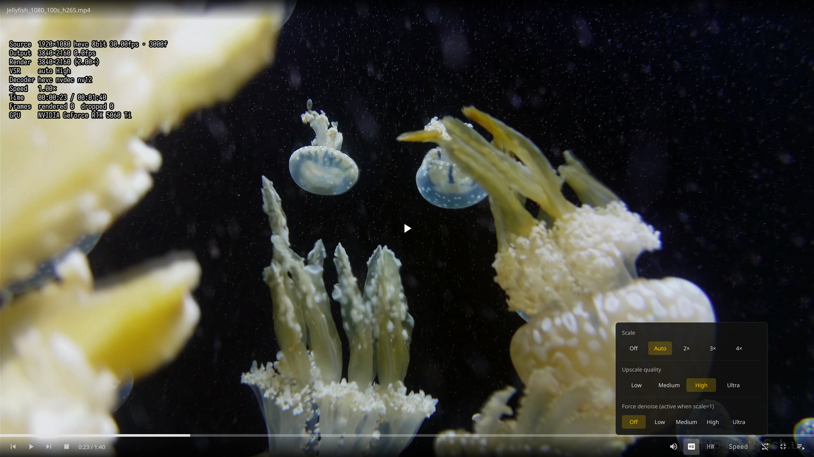

# VSR Player

Linux 桌面实时 AI 超分辨率视频播放器。使用 NVIDIA Video Effects SDK 在视频播放过程中进行神经超分和降噪。

基于 **libmpv**——解封装、解码、音视频同步、时序和 VO 渲染全部由 mpv 承担。VSR 作为自定义 mpv 视频滤镜（`vf_vsr`）注入，通过 CUDA + Video Effects SDK 超分后送回 mpv 管线。前端为 Qt 6 + QML 客户端（Vulkan，与 mpv 共享设备）。

## 背景

NVIDIA RTX Video Super Resolution（RTX VSR）在 Windows 上已经可用了一段时间，通过驱动集成，浏览器和主流播放器都能直接调用。但在 Linux 上，这个驱动级接口并未开放，mpv、VLC 等播放器目前都无法使用 RTX VSR。

NVIDIA Video Effects SDK 提供了相同的底层 AI 模型，也有 Linux 版本，但它并不是一个拿来就能用的依赖——目前还是 Early Access 状态，附带约 1 GB 的推理运行时，也没有现成的播放器集成路径。

这个项目直接调用了 Video Effects SDK 的 C API，将其接入一个播放器中。这不是一条特别合理的路线——这类处理逻辑理应放在驱动或合成器层面——只是在驱动级 VSR 尚未支持 Linux 的情况下的一个变通方案。

## 特性

- **AI 超分辨率** — Tensor Cores 实时 2×/3×/4× 超分（mpv 视频滤镜 `vf_vsr`）
- **AI 降噪** — 可配置降噪强度（低至超高），scale=1 时单独生效
- **AI 插帧（FRUC）** — RIFE 运动插帧至 30/40/60 fps 或任意目标（mpv 视频滤镜 `vf_rife`，TensorRT，在超分之前以源分辨率运行）
- **NVDEC 硬解码** — AV1、H.264、HEVC GPU 解码（含软解回退；软解帧经 `vf_hwup` 自动上传为 CUDA 帧）
- **Vulkan 渲染** — CUDA-Vulkan 共享设备，mpv 渲染进 Qt 场景图
- **QML 叠加 UI** — 底部悬停区域驱动的自动隐藏控件、虚拟化播放列表、OSD 信息面板
- **自适应缩放** — 按视口尺寸自动选择超分倍率
- **播放列表与播放控制** — 目录加载、循环模式、倍速、音视频同步（mpv 承载）
- **远程控制** — Unix socket JSON IPC；独立 `mpv-vsr` CLI 与包装脚本

## 测试现状

本项目在有限的硬件条件下开发——单一 GPU 世代、少量测试样本，无法覆盖所有 GPU/驱动/媒体组合。请对边角问题有预期：你可能会遇到这里从未见过的崩溃、画质异常或卡死。

遇到问题时，一个高效路径是让 AI 编码代理协助排查。本项目本身就是用 AI 代理开发的（Claude Code 驱动 DeepSeek 模型，低成本方案，无需担心成本）：代码、mpv 补丁覆盖层、`docs/` 与提交历史里的设计记录一应俱全，代理可以快速理解管线并定位修复。也欢迎提交 issue 和 PR。

## 截图



### VSR 对比

**原始画面（720p）**


**VSR 4× 超分**


## 架构

```
demux → decode → [vf_hwup] → [vf_rife] → [vf_vsr] → VO (libmpv) → Qt 场景图
                ↑            ↑               ↑
           SW→CUDA 上传    RIFE (TRT)    VFX SDK + CUDA
```

- mpv 承担：解封装、解码、音视频同步、时序、seek、VO
- `vf_hwup`：软解帧上传为 CUDA 帧，使下游滤镜永远只处理硬件帧
- `vf_rife`（覆盖层 `src/mpv/video/filter/vf_rife.c`）：RIFE 插帧（TensorRT），在超分之前以源分辨率运行
- `vf_vsr`（覆盖层 `src/mpv/video/filter/vf_vsr.c`）：接收 `mp_image`，CUDA+VFX SDK 超分，输出超分 `mp_image`
- 前端：Qt 6 + QML（`src/client/`）——MpvController（libmpv 封装）、PlayerViewModel（UI 状态单一事实源）、Vulkan 共享设备
- mpv patch 方案：`third_party/mpv`（纯净 0.41）+ `src/mpv` 覆盖层，`scripts/build_mpv.sh` 合并构建

## 前置要求

| 组件 | 要求 |
|------|------|
| GPU | NVIDIA RTX 20 系或更新（插帧需 Ampere+ 且支持 FP16 Tensor Cores） |
| 驱动 | 570+（含 CUDA；Wayland 需 `nvidia_drm.modeset=1`） |
| Qt | 6.11+（Quick、QuickControls、Vulkan） |
| 编译器 | GCC 13+（C++20） |
| 构建 | meson、ninja、CUDA Toolkit（`/opt/cuda`）、TensorRT（系统 `trtexec`，构建引擎用） |

第三方 SDK（NvVFX 头文件/运行时、MDI 图标字体、mpv 源码）**不随仓库分发**——按 [docs/third-party-setup.md](docs/third-party-setup.md) 准备 `third_party/`。

## 手工构建

1. **准备 `third_party/`** — NvVFX SDK 头文件/运行时、MDI 图标字体、mpv 源码、CUDA 12 存档、RIFE ONNX 资产：按 [docs/third-party-setup.md](docs/third-party-setup.md) 操作。
2. **构建并运行：**

```bash
./scripts/build_mpv.sh          # 合并 src/mpv 覆盖层 → third_party/mpv，构建 libmpv + 滤镜
ninja -C build                  # 构建 Qt 客户端
./build/src/client/vsr-player <视频或目录>
```

**注意事项（都是踩过的坑）：**

- **mpv patch 方案**：`third_party/mpv` 是纯净基座；`src/mpv/` 是覆盖层（镜像 mpv 树，只含修改文件）。改完 `src/mpv/` 下任何文件后**必须重跑 `./scripts/build_mpv.sh`**——`build/mpv` 是合并副本，单独对其增量 `ninja` 会静默沿用旧副本掩盖修改（完整重建才会暴露，实测教训）。
- **`build_mpv.sh` 输出经 grep 过滤**——编译失败可能看不到；确认构建真正完成要检查最后一行 "Done"。
- **别 `cd build` 后再用 `./build/...`**——相对路径会失效；留在仓库根或用绝对路径。
- **系统库升级后**（FFmpeg、Qt、TensorRT——pacman/apt）需全量重建（`./scripts/build_mpv.sh` + `ninja -C build`）：旧二进制链接旧 soname，会直接启动失败。
- **RIFE 引擎**：用系统 `trtexec` 构建（`bash tests/fruc/build_rife_full_engine.sh`，动态 shape FP16；分发用 `--hardware-compat on` 跨架构）。需要 `third_party/rife/` 下的 RIFE ONNX 资产。
- **开发安装**：仓库内直接跑 `./scripts/install.sh` 即可（dev 模式，自动识别构建树，无需 tarball）。
- **分发构建**：`./scripts/build_release.sh`——release + `$ORIGIN` 相对 RPATH + 依赖收集 + tarball。`build_mpv.sh`/client 构建接受 `MPV_BUILD_DIR`、`BUILDTYPE`、`DIST_RPATH` 环境变量覆盖（发布脚本使用）。

## 分发（release tarball）

```bash
./scripts/build_release.sh      # → build/vsr-player-<ver>-linux-x86_64.tar.xz（~316 MB）
tar -xJf vsr-player-<ver>-linux-x86_64.tar.xz
./install.sh                    # 安装到 ~/.local（bin + lib/vsr-player），无需 sudo
```

- 捆绑：libmpv + ffmpeg×7 + CUDA runtime + TensorRT 11 + RIFE 引擎（ampere+，30/40/50 系通用一份）+ 字体/翻译/许可
- **不捆绑**：VFX SDK（~1.1 GB）——NVIDIA SLA 限制再分发；install.sh 可代从 PyPI 官方 `nvidia-vfx` wheel 下载提取（curl 纯下载，不调 pip、不改系统），或手动放置到 `~/.local/lib/vsr-player/`
- GUI 运行时依赖系统 Qt ≥ 6.11；唯一强制外部依赖为 NVIDIA 驱动（`libcuda.so.1`）

## 版本兼容性

| 组件 | 绑定关系 | 不匹配时 |
|------|----------|----------|
| **VFX SDK ↔ 驱动** | PyPI 最新 wheel 可能要求更新的驱动；旧驱动 + 新 VFX → VSR 加载失败 | 升级驱动，或锁定旧版 VFX（见下） |
| **RIFE 引擎 ↔ TensorRT** | 引擎文件内嵌构建时的 TRT 精确版本——版本不匹配时反序列化直接拒绝（双向均实测） | 用当前系统 TRT 重建引擎（`bash tests/fruc/build_rife_full_engine.sh`），或装匹配版本 TRT。tarball 用户：引擎与捆绑 TRT 一起分发，自洽。VFX 自带的 TRT 10 与 RIFE 的 TRT 11 同进程共存（RTLD_LOCAL 隔离），无需处理 |
| **Qt** | 硬性要求 ≥ 6.11（用到的 QML/QuickControls 特性） | 无降级选项——升级系统 Qt |
| **GPU** | VSR 需 RTX 20+；插帧需 Ampere+（FP16 Tensor Cores） | 旧 GPU：VSR 可用，插帧退化为直通 |
| **驱动** | VFX 需 570+；Wayland 需 `nvidia_drm.modeset=1` | 升级驱动，或锁定旧版 VFX wheel |

**锁定 VFX SDK 版本**——install.sh 总是从 PyPI 拉取**最新** `nvidia-vfx` wheel。如果默认版本在你的环境不工作（如驱动太旧），不必被迫使用它：

```bash
# 1. 查看可用版本
pip index versions nvidia-vfx        # 或浏览器: pypi.org/project/nvidia-vfx/#files

# 2. 下载指定版本 wheel（pip download 只取文件，不安装）
pip download nvidia-vfx==<版本> --no-deps -d /tmp/vfx

# 3. 解压其库文件到应用库目录
unzip -o /tmp/vfx/nvidia_vfx-<版本>*.whl "nvvfx/libs/*" -d /tmp/vfx
cp /tmp/vfx/nvvfx/libs/*.so* ~/.local/lib/vsr-player/
```

注意：`vsr_proc.c` 以**无版本名** dlopen（`libnppc.so`、`libcudnn.so`、`libnvidia-ngx-vsr.so` 等），而 wheel 只含带版本名文件（`.so.12`、`.so.9`……）。install.sh 的自动下载路径会补无版本软链；**手动放置时需自行补齐**，否则 VFX 加载链断裂（超分静默直通）：

```bash
cd ~/.local/lib/vsr-player/
for t in libnppc libnppial libnppicc libnppidei libnppig libnppif \
         libnppim libnppist libnppitc libcudnn libnvidia-ngx-vsr; do
  for s in "$t".so.*; do [ -e "$s" ] && ln -sf "$s" "$t.so" && break; done
done
```

install.sh 从不把任何版本强加给你的系统——一切都在 `~/.local/lib/vsr-player/` 内，替换该目录下的 VFX 文件即是官方支持的切换方式。

## 使用

- 打开文件或目录（目录会把全部可播放文件加载进播放列表）
- 画质控制：底栏 `画质` 弹窗——缩放 off/auto/2×/3×/4×、超分质量、降噪
- 播放列表：`P` 键；UI 自动隐藏由底部悬停区域驱动（鼠标移出即隐藏）
- OSD：`Tab` 切换 mpv 渲染的信息浮层（源/输出/渲染/解码器/GPU…）

### 命令行选项

| 选项 | 取值 | 默认 | 说明 |
|------|------|------|------|
| `--scale` | `off`、`auto`、`2`、`3`、`4` | `auto` | 超分倍率 |
| `--quality` | `low`、`medium`、`high`、`ultra` | `high` | 超分质量 |
| `--denoise` | `off`、`low`、`medium`、`high`、`ultra` | `off` | 降噪强度（scale=1 时生效） |
| `--fruc` | `off`、`30`、`40`、`60`、`2`、`3`、`4` | 持久化 | 插帧：目标帧率（30/40/60）或倍率（2/3/4，benchmark 模式） |
| `--no-hwaccel` | — | — | 关闭 NVDEC，使用软解 |
| `--lang` | 如 `en`、`zh_CN` | 系统 locale | 界面语言 |
| `--benchmark` | — | — | 无 UI 吞吐测量（`all=no` 日志） |
| `--vsync` | — | off | FIFO present（默认非阻塞；wayland 无撕裂问题） |
| `--no-rpc` | — | — | 关闭 JSON IPC 服务 |

### 快捷键

| 按键 | 动作 |
|------|------|
| `Space` | 播放 / 暂停 |
| `←` / `→` | 快退 / 快进 ±5s（`Shift` + 方向键 = ±10s） |
| `↑` / `↓` | 音量 ±5% |
| `S` | 截图 |
| `Tab` | 切换 OSD |
| `N` / `B` | 下一首 / 上一首 |
| `[` / `]` / `\` | 倍速 0.5× / 2× / 1× |
| `P` | 开关播放列表 |
| `F` | 切换全屏 |
| `Esc` | 退出全屏 / 关闭播放列表 |

## 远程控制

Unix socket JSON IPC（`/tmp/vsr-player.sock`）：

```bash
printf '{"command":["play"]}\n' | socat - UNIX-CONNECT:/tmp/vsr-player.sock
```

命令：`play`、`pause`、`stop`、`seek`、`loadfile`、`set-vsr`、`get-vsr`、`quit`，及原始 `command` 透传。独立 CLI（`scripts/install_mpv_local.sh`）安装 `mpv-vsr`——带 `--vf=vsr` 支持的 patched mpv。

## 独立版 mpv-vsr CLI

带 `vf_vsr` + `vf_rife` + `vf_hwup` 滤镜的 patched mpv 也独立构建分发，可作普通 mpv 替代：

```bash
mpv-vsr --hwdec=auto --vf=hwup,rife:fps=60,vsr:scale=2 video.mkv
```

滤镜链（从左到右）：`hwup`（SW→CUDA 上传，软解路径可用）→ `rife`（插帧，源分辨率）→ `vsr`（超分）。硬解（`--hwdec=nvdec`）时 `hwup` 为纯直通可省略。

滤镜选项：

| 选项 | 取值 | 说明 |
|------|------|------|
| `scale`（vsr） | `off`、`auto`、`2`、`3`、`4`、比例（如 `4/3`） | 超分倍率；`auto` 按视口选择 |
| `quality`（vsr） | `low`、`medium`、`high`、`ultra` | VSR 推理质量 |
| `denoise`（vsr） | `off`、`low`、`medium`、`high`、`ultra` | 降噪（scale=1 时单独生效） |
| `fps`（rife） | `off`、`auto`、整数 1..120 | 插帧目标帧率；`auto` = 2×源 |
| `scale`（rife） | `off`、`2`、`3`、`4` | benchmark 倍率（无自适应直通） |
| `adaptive`（rife） | `yes`、`no` | 插帧过慢时按成本直通 |

示例：`mpv-vsr --hwdec=nvdec --vf=rife:fps=60,vsr:scale=auto,quality=ultra video.mkv`

`mpv-vsr-wrapper.py`（浏览器集成，ff2mpv 风格）：导出 Chrome cookie、yt-dlp 提取播放列表（YouTube/Bilibili/Niconico）、拉起 mpv-vsr。

## 开源协议

VSR Player 采用 GNU General Public License v2 或更高版本 (GPLv2+)。

完整协议文本见 [LICENSE](LICENSE)。

项目基于 [mpv](https://github.com/mpv-player/mpv)（GPLv2+）构建：编译带自定义
`vf_vsr` 滤镜的 patched mpv，前端链接 libmpv——因此分发的二进制是 mpv 的
衍生作品，整个项目按 GPLv2+ 分发。Qt/QML 前端代码本身为独立开发。

运行时动态加载的 NVIDIA Video Effects SDK 库为 NVIDIA 专有软件，
不受本项目 GPL 许可证约束。

---

[English](README.md)
